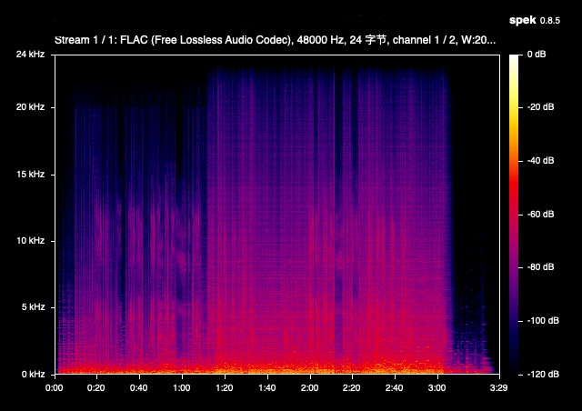
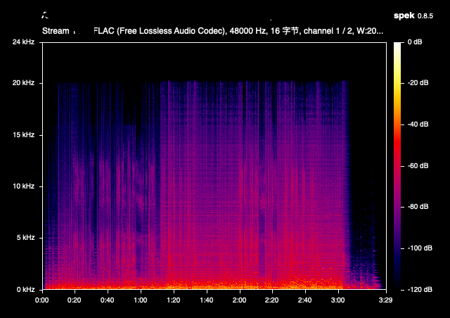

# lossless-checker

[中文说明](./README.zh-CN.md)

A heuristic detector for **fake lossless** audio — files transcoded from a lossy source
(e.g. 320k MP3) and then re-wrapped as FLAC/ALAC to masquerade as lossless, plus **fake Hi-Res** —
CD/lossy material upsampled into a 96/192 kHz container. Point it at one file for a verdict, or at a
whole library for a ranked report of the suspects.

- **Read-only** — it analyzes and reports; it never moves, renames, or deletes anything.
- **Pure-Rust decoding** for FLAC, ALAC, WAV, AIFF, CAF, etc. — no system dependencies. DSD
  (`.dsf`/`.dff`) decodes via an **optional ffmpeg fallback** (only needed if you scan DSD).
- **Hi-Res aware** — detects upsampling, empty high-frequency bands, and spectral holes.
- **Parallel** — a multi-thousand-file library scans in a few minutes on a modern machine.

## How it works

Everything is derived from the decoded PCM — the container's claimed format, bitrate, and sample
rate are never trusted. The tool decodes the audio (via
[symphonia](https://github.com/pdeljanov/Symphonia); ffmpeg for DSD), runs a
Blackman-Harris-windowed FFT ([rustfft](https://github.com/ejmahler/RustFFT)) across the
**whole track**, averages the power spectrum, and runs three detectors over it. The
Blackman-Harris window's low sidelobes (~−92 dB) keep low-band energy from leaking up and
masking the lossy cutoff cliff.

**1. High-frequency cutoff (lossy transcode).** A lossy codec low-passes at a fixed frequency,
leaving an **energy cliff** whose location betrays the original bitrate:

| Source            | Typical cutoff |
|-------------------|----------------|
| Genuine lossless  | ~19–23 kHz     |
| 256k transcode    | ~18–19 kHz     |
| 128k transcode    | ~16 kHz        |
| lower bitrate     | ~12–15 kHz     |

The cutoff is the highest frequency whose energy still stays within ~65 dB of the track's own
spectral **peak** (a **peak-relative** threshold).

**2. Sample-rate authenticity (fake Hi-Res / upsampling).** For a declared Hi-Res file (> 48 kHz),
genuine content extends well past the CD wall (~22 kHz). When the real content instead stops near
22 kHz with an **empty band above ~26 kHz**, the file is CD/lossy material upsampled into a Hi-Res
container — flagged 🔼 Upsampled. The reported *HF extension* metric (dB of energy above 26 kHz,
relative to the peak) makes the gap obvious: genuine Hi-Res sits around −30 dB, an upsample sinks
below −70 dB.

**3. Spectral holes (informational).** AAC/Vorbis transcodes can leave notches below the cutoff.
These are detected and reported, but — being false-positive-prone on real music — they **never
change the verdict**.

Two deliberate design points:

- **Peak-relative, not noise-floor-relative.** Referencing the loud mid-band peak (instead of the
  near-silent top of the spectrum) means a hard low-pass shows up as a true cliff even when the
  track has little high-frequency energy to begin with — orchestral and vocal transcodes that a
  noise-floor method reads as "full-band" are caught correctly.
- **Whole-track analysis.** Many songs open with a quiet intro and only bring in cymbals/percussion
  later, so sampling just the head would underestimate the cutoff and cause false positives.

## Install

Grab a prebuilt binary from the [latest release](https://github.com/NaughtyDogOfSchrodinger/lossless-checker/releases/latest) — no toolchain required. Pick the asset for your platform:

| Platform                 | Asset                                                  |
|--------------------------|--------------------------------------------------------|
| macOS (Apple Silicon)    | `lossless-checker-<ver>-aarch64-apple-darwin.tar.gz`   |
| macOS (Intel)            | `lossless-checker-<ver>-x86_64-apple-darwin.tar.gz`    |
| Linux (most distros)     | `lossless-checker-<ver>-x86_64-unknown-linux-gnu.tar.gz` |
| Linux (static / musl)    | `lossless-checker-<ver>-x86_64-unknown-linux-musl.tar.gz` |
| Windows (x64)            | `lossless-checker-<ver>-x86_64-pc-windows-msvc.zip`    |

**macOS / Linux:**

```bash
tar xzf lossless-checker-*.tar.gz
cd lossless-checker-*/
./lossless-checker check "path/to/song.flac"
```

On macOS, Gatekeeper quarantines binaries downloaded from the web. If you see *"cannot be opened because the developer cannot be verified"*, clear the quarantine flag once:

```bash
xattr -d com.apple.quarantine ./lossless-checker
```

To run it from anywhere, move it onto your `PATH`, e.g. `sudo mv lossless-checker /usr/local/bin/`.

**Windows:**

Unzip the archive and run `lossless-checker.exe` from PowerShell or `cmd`:

```powershell
.\lossless-checker.exe check "path\to\song.flac"
```

If SmartScreen warns about an unrecognized app, choose **More info → Run anyway**.

> The `<ver>` placeholder matches the release tag, e.g. `v0.1.0`. In the [Usage](#usage) examples below, substitute the binary path (`./lossless-checker`) wherever a command shows `cargo run --release --`.

## Build

To build from source instead (requires a [Rust toolchain](https://rustup.rs/)):

```bash
cargo build --release
# binary at ./target/release/lossless-checker
```

### Optional: DSD support

DSD (`.dsf`/`.dff`) has no pure-Rust decoder, so the tool shells out to **ffmpeg** to decode it to
PCM. Everything else works without ffmpeg. Install it only if you need to scan DSD:

```bash
# macOS
brew install ffmpeg
# Debian/Ubuntu
sudo apt install ffmpeg
```

If ffmpeg is missing and you point the tool at a DSD file, it reports a clear error for that file
and moves on — the rest of the scan is unaffected.

DSD is judged on its **audible band only**: its ultrasonic region is noise-shaping noise (not
signal) and what survives decoding depends on the decimation filter, so the Hi-Res upsample check
is *not* applied to DSD (doing so would false-positive on every DSD). A DSD genuinely sourced from a
low-bitrate lossy master is still caught via its audible cutoff (🚩 below 16.5 kHz).

## Usage

There are two subcommands:

- **`check`** — the PCM fake-lossless detector (FLAC/ALAC/WAV/…; DSD via ffmpeg → PCM). Everything
  in this section.
- **`check-dsd`** — native **DSD authenticity** check (parses `.dsf` itself, no ffmpeg). See
  [DSD authenticity](#dsd-authenticity-check-dsd) below.

> Logs and reports default to **Chinese**. Pass `--lang en` for English (as shown in the examples
> below). The machine-readable JSON report is the same regardless of language.

**Single file** — detailed verdict:

```bash
cargo run --release -- check "path/to/song.flac" --lang en
```

```
File: song.flac
Format: FLAC
Sample rate: 48000 Hz
Total samples: 12582912
Nyquist frequency: 24000 Hz
Estimated HF cutoff: 20795 Hz (86.6% of Nyquist)
Spectral holes: none significant

Verdict: ✅ High frequencies extend naturally — looks like genuine lossless
```

A declared Hi-Res file that is really upsampled shows an extra `HF extension` line and the
🔼 verdict:

```
File: fake96.flac
Format: FLAC
Sample rate: 96000 Hz
Total samples: 288000
Nyquist frequency: 48000 Hz
Estimated HF cutoff: 24598 Hz (51.2% of Nyquist)
HF extension (>26kHz): -114.3 dB (relative to spectral peak; lower = emptier highs)
Spectral holes: none significant

Verdict: 🔼 Declared as Hi-Res, but real content stops at the ~CD band — likely upsampled / lossy-sourced fake Hi-Res
```

**Whole library** — pass a directory to scan it recursively, in parallel, and emit a ranked report:

```bash
cargo run --release -- check ~/Music --report scan.txt --json scan.json
```

The text report has a summary, an **album ranking** (by 🚩/🔼 count — a whole album cut at the same
low frequency is the strongest signal of a lossy source), the full flagged list (🚩/🔼 then ⚠️,
sorted by cutoff), and a **decode-failure list** (surfaced, never silently dropped):

```
== Summary ==
  ✅ Likely lossless (≥19kHz)     2086
  ⚠️  Narrowed HF (16.5-19kHz)     515
  🚩 Highly suspect (<16.5kHz)    185
  🔼 Fake Hi-Res (upsampled)      12
  ✖  Decode failed                0

== Albums ranked (by 🚩/🔼 count, descending) ==
  🚩/🔼 15  ⚠️  0  Some Artist - Debut Album (2006)
  ...

== Flagged files (🚩/🔼 first, each by cutoff ascending) ==
   12672 Hz  🚩  Some Artist - Album/03. track.flac
   24598 Hz  🔼  Some Artist - Hi-Res Album/01. track.flac
   17800 Hz  ⚠️  Other Artist - Album/05. track.flac
   ...
```

With `--json` you also get machine-readable output. Hi-Res files additionally carry
`hires_ext_db`; every result carries `format_label` and a `holes` count:

```json
{
  "root": "/Users/you/Music",
  "scanned": 2786,
  "summary": { "clean": 2469, "narrowed": 234, "suspect": 83, "upsampled": 12, "error": 0 },
  "results": [
    { "path": "Album/track.flac", "format_label": "FLAC", "sample_rate": 44100, "cutoff_hz": 12672.0, "ratio": 0.5747, "holes": 0, "verdict": "suspect" },
    { "path": "HiRes/track.flac", "format_label": "FLAC", "sample_rate": 96000, "cutoff_hz": 24598.0, "ratio": 0.5125, "hires_ext_db": -114.3, "holes": 0, "verdict": "upsampled" }
  ]
}
```

### Options

| Flag           | Default                 | Description |
|----------------|-------------------------|-------------|
| `--peak-db`    | `65`                    | Peak-relative threshold (dB below the spectral peak) for the default detector. Calibrated; override only for debugging. |
| `--noise-floor`| off                     | Use the legacy noise-floor detector (with `--threshold`) instead of peak-relative. Kept for comparison. |
| `--threshold`  | `10.0`                  | Noise-floor multiplier — only used with `--noise-floor`. |
| `--report`     | stdout                  | Write the text report to this file (directory scan only). |
| `--json`       | —                       | Also write a JSON report to this file (directory scan only). |
| `--ext`        | `flac,wav,m4a,aif,aiff,caf,alac,dsf,dff` | Comma-separated extensions to scan. Lossless containers + DSD only — scanning mp3 etc. is pointless for fake-lossless detection. |
| `--jobs`       | CPU cores               | Number of parallel worker threads. |
| `--lang`       | `zh`                    | Output language for logs and reports: `zh` (中文, default) or `en`. The JSON report is unaffected. |

### Verdict tiers

For **CD-rate** files (≤ 48 kHz) the verdict is based on the **absolute cutoff frequency in Hz**,
not a ratio of Nyquist, because lossy codecs low-pass at a fixed Hz regardless of the container's
sample rate. A ratio-of-Nyquist would wrongly flag perfectly good 48 kHz files (whose real content
also stops at ~21–22 kHz — only ~88% of their 24 kHz Nyquist).

| Cutoff           | Verdict |
|------------------|---------|
| `≥ 19 kHz`       | ✅ Looks like real lossless |
| `16.8 – 19 kHz`  | ⚠️ Narrowed — possible high-bitrate transcode, check manually |
| `< 16.8 kHz`     | 🚩 Clear cliff — highly suspect fake lossless |

For **Hi-Res** files (> 48 kHz) the question is instead *"does real content actually reach past the
CD wall?"*. A file is 🔼 **Upsampled** when its real content stops below ~28 kHz **or** the band
above 26 kHz is empty (HF extension ≪ −70 dB); otherwise it passes as ✅ Clean. This catches CD or
lossy material upsampled into a Hi-Res container, which the absolute-Hz cutoff alone would wave
through.

### Calibration

Tuned against a real library of ~2786 FLAC files **plus known-answer round-trip fakes** — a real
FLAC re-encoded through 128k/320k MP3 and back, which is a perfect "fake lossless" with a known
original bitrate:

- **Peak-db (65):** swept 45→75. Too low collapses even genuine weak-HF tracks; too high lets 128k
  residue read as full-band again. At 65, every 128k fake lands at **16.0–16.7 kHz** (caught) while
  genuine lossless clusters at **21–22 kHz**.
- **Verdict cutoffs:** genuine library files cluster at 19–22 kHz; 128k round-trips sit just under
  16.8 kHz, so that's the 🚩 line.

## DSD authenticity (`check-dsd`)

`check` judges DSD on its *audible band* (via ffmpeg → PCM), which only catches DSD sourced from a
low-bitrate lossy master. The mirror problem — **CD/PCM "washed" into DSD** — needs a different
signal, so it has its own subcommand:

```bash
cargo run --release -- check-dsd ~/DSD --album-summary --lang en
```

`check-dsd` **does not use ffmpeg**. It parses the `.dsf` container itself, pulls the raw 1-bit
stream, and measures its full-band power spectrum up to the DSD Nyquist (~1.41 MHz for DSD64). That
exposes the one fingerprint a transcoder can't cheaply fake: **noise shaping** — the Sigma-Delta
quantization noise a genuine DSD master pushes up into 50–100 kHz (a strong positive slope). A
PCM/lossy source converted to DSD lacks that rise and often still carries a CD/lossy cutoff in the
baseband. The bitstream is processed streaming, so memory stays decoupled from file size.

Each file is judged **Pass** / **Suspicious** / **Unsupported** from three metrics: noise-shaping
slope (dB/oct), ultrasonic energy ratio (>50 kHz), and baseband cutoff (≤24 kHz only, so a DXD
workflow's 176 kHz corner is never mistaken for a CD wall). The **slope is primary** and gates how
the cutoff is read: when it confirms genuine SDM, a baseband cutoff is taken as natural master
roll-off and only a hard low cliff (<16.5 kHz) still convicts — a 2020 vocal/acoustic master rolling
off at ~19 kHz is *not* flagged. Only when the slope is flat does a mid-band cutoff count as
corroborating evidence of a PCM/lossy source.

Separately, a **sharp brick-wall step right at 22.05 kHz** (a `cd_wall` flag) convicts even with a
genuine slope: it is the digital-ADC fingerprint that survives a CD→DSD re-modulation, distinct from
a gentle analog roll-off. (In testing this flagged a 1993 CD-era album whose DSD reissue carries an
album-wide 22.05 kHz wall, while a 1977 analog-master DSD and a 2020 native DSD show no such step.)

```
== Summary ==
  ✅ Pass          124
  🚩 Suspicious    8
  ⛔ Unsupported   3
  ✖  Parse error   0
```

> **Status:** v1.0. It parses **DSF** and **DFF** (uncompressed); **DST-compressed** DSD reports
> `Unsupported`. The thresholds (`--min-slope 6.0`,
> `--min-hf-ratio 0.05`) are *starting* defaults — calibrate them against labelled real/fake/DXD
> samples before trusting borderline verdicts. Run `check-dsd --help` for all knobs (`--fft-size`,
> `--slope-lo/-hi`, `--hf-threshold`, `--format json`, `-v`).

**Export a spectrum** for plotting (the genuine-vs-fake comparison that drives calibration):

```bash
cargo run --release -- export-spectrum "track.dsf" -o track.csv   # or --channel 0
```

It writes `frequency_hz,power_db` rows (default `<file>.spectrum.csv`, all channels mixed). Feed it
to gnuplot/matplotlib/Excel — a genuine DSD shows the baseband, then a steep noise-shaping rise past
50 kHz; a PCM/lossy-sourced fake shows a flat ultrasonic region (and often a CD/lossy baseband
cutoff).

The thresholds and the calibration method (with a first verified real-DSD reference sample) are
documented in [`docs/calibration.md`](docs/calibration.md).

## Limitations

This is a **heuristic**, not proof. The 320k blind spot below is the clearest example — here is a
genuine lossless track next to a 320k MP3 transcode, both 48 kHz, viewed in Spek:

| Genuine lossless | 320k MP3 transcode |
|------------------|--------------------|
|  |  |

The genuine file's energy extends naturally toward the top; the 320k transcode has a hard low-pass
**wall near ~20 kHz**. A human eye spots the wall instantly, but it sits right where plenty of real
lossless rolls off, so the cutoff metric can't separate them and reads the fake as ✅ — exactly why
you should eyeball suspect files in Spek.

The full set of caveats:

- **False positives:** classical, acoustic, vocal, ambient, and old recordings naturally have
  little high-frequency energy and may show up as ⚠️ or 🚩. Interludes, skits, and solo-piano
  tracks routinely do. Treat **album-wide** patterns as the real signal, not isolated tracks.
- **False negatives — high-bitrate and transparent codecs are the blind spot.** Round-trip tests
  show 128k fakes are caught reliably (~16.5 kHz), but the cliff heuristic only works against codecs
  that apply a low, hard lowpass. It cannot see:
  - **320k MP3** — low-passes at ~20 kHz, overlapping where genuine lossless naturally rolls off.
  - **High-bitrate AAC (256k+)** — soft lowpass at ~19–20 kHz, in that same overlap. AAC's
    sub-cutoff notches are *reported* (detector #3) but never drive the verdict — too noisy on
    natural musical nulls.
  - **Opus** — at fullband bitrates it has no lowpass wall at all and is transparent by design, so
    there is no cliff to find; it reads ✅ every time.

  No cutoff-based metric can separate these from genuine lossless. This tool catches obvious
  low-bitrate fakes, not transparent ones.
- **Hi-Res thresholds are heuristic too.** The upsample check assumes genuine Hi-Res content
  reaches past ~28 kHz; a legitimate master that genuinely rolls off below that (rare — usually an
  old analog source) can read 🔼. The thresholds ship as reasoned defaults pending calibration
  against a labelled Hi-Res fixture set.
- **DSD under `check` needs ffmpeg** (see [above](#optional-dsd-support)); without it, DSD files are
  skipped with an error rather than analyzed. The native [`check-dsd`](#dsd-authenticity-check-dsd)
  subcommand needs no ffmpeg.
- **Performance:** it decodes every track in full, so a large library takes a few minutes (it runs
  on all CPU cores). Single-file checks are near-instant.

Its job is to **batch-flag the highly suspicious files** in a large library. Always confirm a
flagged file by eyeballing its spectrogram in a tool like [Spek](https://www.spek.cc/) before
drawing conclusions.

Planned mitigations for these limitations are tracked in [ROADMAP.md](./ROADMAP.md).

## License

GPL-3.0 — see [LICENSE](./LICENSE).
